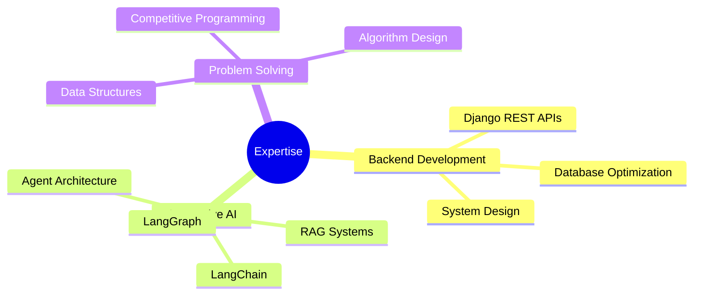

# 👋 Hi, I'm K. M. Abul Farhad-Ibn-Alam

<div align="center">
  
[](https://linkedin.com/in/abulfarhad)
[](mailto:abulfarhad.ibnalam@gmail.com)
[](your-profile-link)

</div>

## 🚀 About Me

Software Engineer specializing in **Backend Development** and **Generative AI**. I build production-ready REST APIs with Django and develop agentic AI applications using LangChain, LangGraph, and RAG.

```python
class SoftwareEngineer:
    def __init__(self):
        self.name = "Abul Farhad"
        self.role = "Software Engineer I @ Brain Station 23"
        self.location = "Dhaka, Bangladesh"
        self.education = "B.Sc. in Computer Science - Brac University"
        
    def get_specializations(self):
        return ["Backend Development", "Generative AI", "REST APIs", "RAG Systems"]
```

## 💼 Current Work

- 🏢 **Software Engineer I** at Brain Station 23 (Mar 2025 - Present)
- 🔨 Building enterprise REST APIs with Django
- 🤖 Developing AI agents with LangChain & LangGraph
- 📦 Maintaining [RAGnificentAI](https://pypi.org/project/ragnificentai/) - Python package for RAG applications

## 🛠️ Tech Stack

**Languages**
```
Python  |  C++  |  Java  |  JavaScript  |  TypeScript
```

**Frameworks & Tools**
```
🔧 Backend:      Django, REST APIs
🤖 AI/ML:        LangChain, LangGraph, RAG
🗃️ Database:     PostgreSQL
⚙️ DevOps:       Docker, Git, n8n
💻 Frontend:     jQuery
```

## 🏆 Achievements

- 🥉 **ICPC Asia-West Finalist 2023** - Honorable Mention
- 🏅 **BRACU CS Spectrum Contest** - Rank 3/60+
- 💻 **Codeforces Pupil** - Max Rating: 1235
- ⭐ **Codechef 3 Star** - Max Rating: 1659

## 📦 Featured Projects

### [RAGnificentAI](https://pypi.org/project/ragnificentai/) 
> Lightweight Python package for building RAG-based chatbots
- 🔹 Abstracts boilerplate LangChain components
- 🔹 Modular design with pluggable tools and agents
- 🔹 Published on PyPI

### [Shoppio - AI Shopping Assistant](https://github.com/yourusername/shoppio)
> Multi-agent chatbot for shopping assistance
- 🔹 Built with LangChain & LangGraph
- 🔹 RAG-powered product recommendations
- 🔹 Django backend with vector database integration

## 📊 GitHub Stats

<div align="center">
  


</div>

## 🎯 Focus Areas



## 📫 Let's Connect

- 💼 LinkedIn: [linkedin.com/in/abulfarhad](https://linkedin.com/in/abulfarhad)
- 📧 Email: abulfarhad.ibnalam@gmail.com
- 📱 Phone: +880 1521 561986

---

<div align="center">
  
💡 *"Building intelligent systems that solve real-world problems"*


</div>
